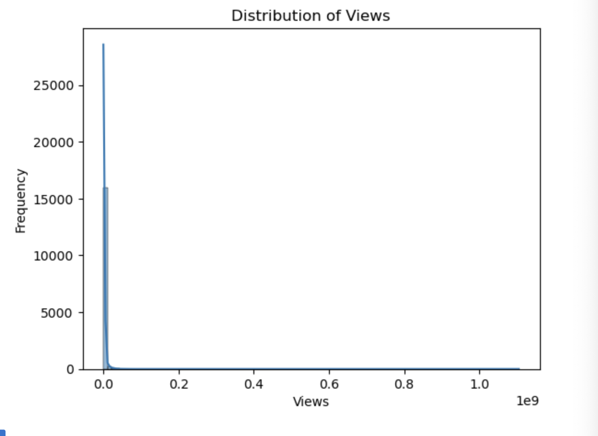
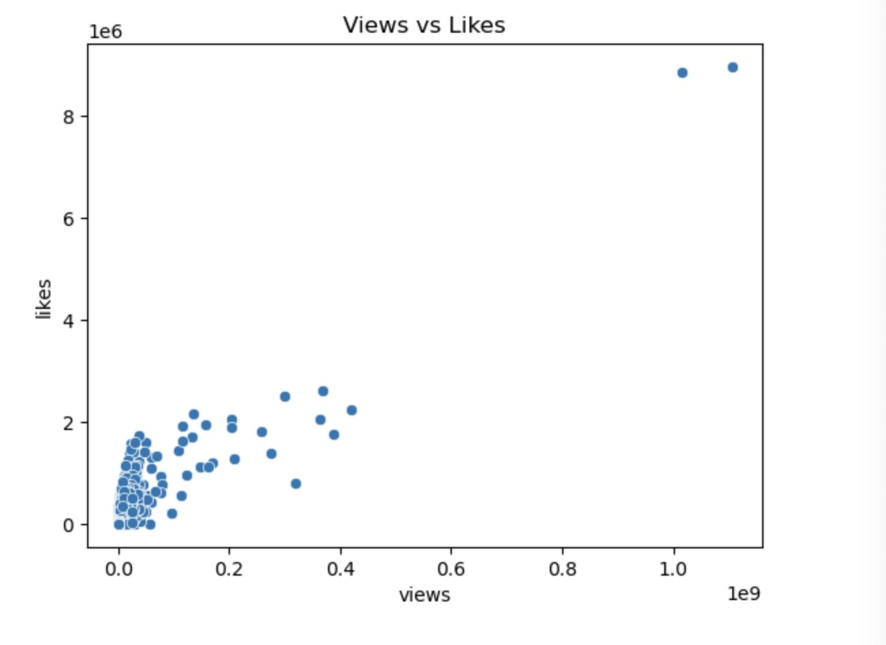
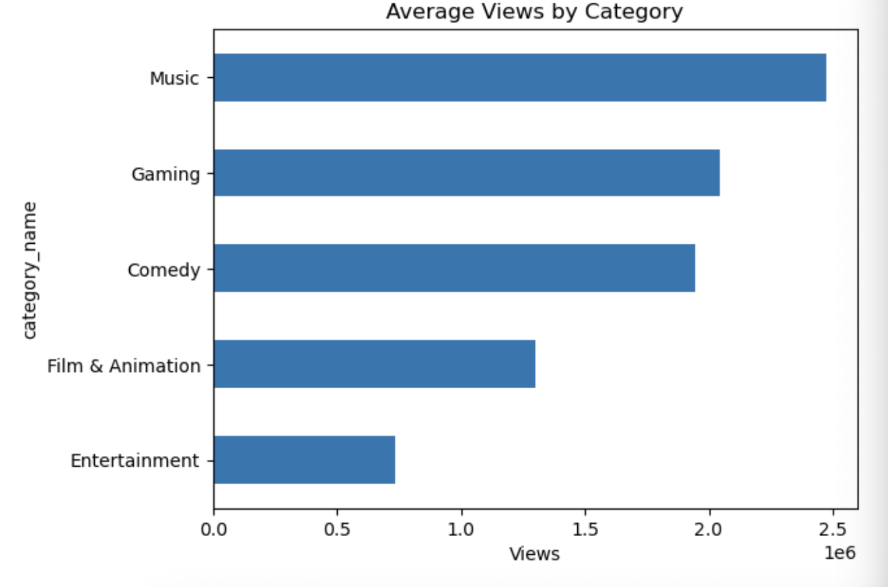
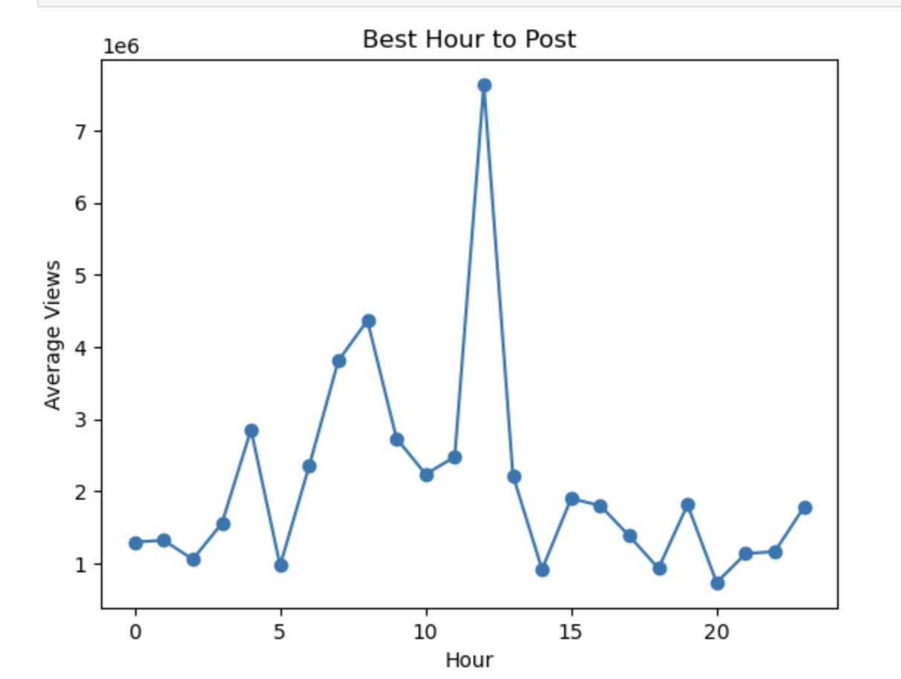
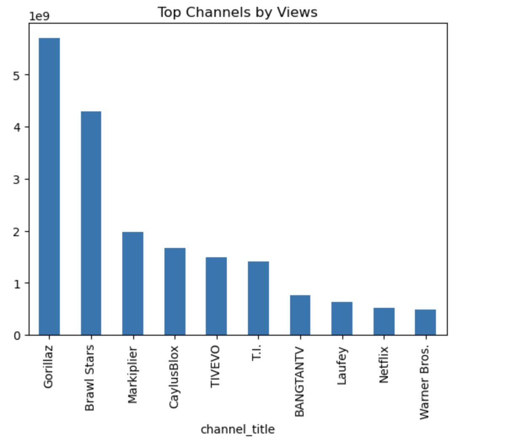
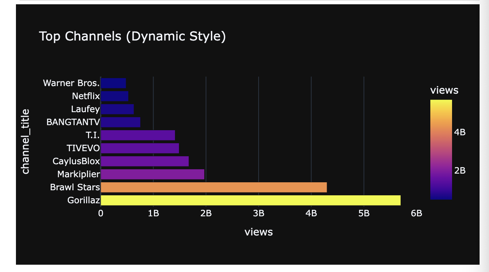
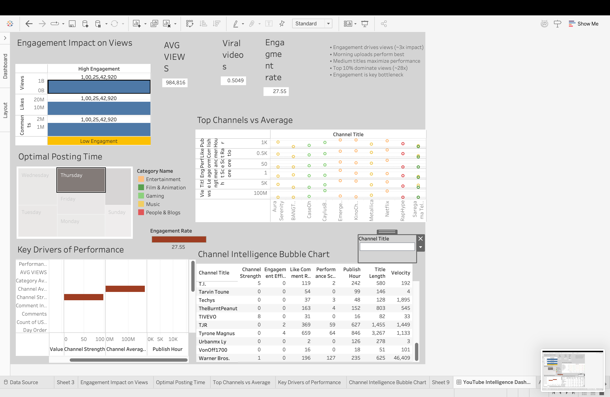

## The Alchemy of Virality: A Journey Through YouTube’s Trending Engine
The Narrative: Beyond the Play Button
Every day, the YouTube "Trending" tab represents the most valuable real estate on the internet. For a creator or a brand, appearing here is the difference between obscurity and global influence. However, the path to the top is often viewed as a "black box" of mystery and luck.

In this project, My mission was to dismantle the black box and rebuild it into a transparent, predictable model. I set out to answer one definitive question: Can we engineer virality using historical patterns and statistical signals?

## The Investigation: Tools of the Trade
## Phase 1: The Detective Work (Python & EDA)
The journey began with raw, unrefined data. Using Python, I acted as a forensic analyst, cleaning noisy datasets and synchronizing timestamps. I moved beyond simple averages to build an Animated Engagement Funnel. This allowed me to visualize, for the first time, how a video breathes—how views turn into likes, and how those likes ignite a "chain reaction" of comments over a 24-hour cycle.

## 1. Views Distribution (Winner-Takes-All)

Most videos receive relatively low views, while a small percentage achieve extremely high visibility. This indicates a highly skewed distribution where a few viral videos dominate overall traffic on the platform.

## 2. Views vs Likes

There is a strong positive relationship between views and likes, showing that higher reach generally leads to more engagement. However, not all high-view videos receive proportional likes, highlighting the importance of content quality.

## 3. Category Performance

Different content categories exhibit varying performance patterns. Some categories consistently generate higher views, while others achieve stronger engagement rates despite lower reach, indicating differences in audience behavior.

## 4. Best Time to Post

Video performance varies significantly based on publishing time. Certain hours consistently generate higher views, suggesting that aligning uploads with peak user activity can improve visibility and engagement.

## 5. Top Channels

A small number of channels contribute a large share of total views, indicating strong concentration in content performance. Established creators tend to dominate due to existing audience base and reach.

## 6. Funnel Analysis (Most Important)

There is a significant drop-off as users move from viewing a video to liking and commenting. While many users watch content, only a small percentage actively engage, highlighting engagement as the key bottleneck in content performance.
## Phase 2: The Structural Blueprint (SQL)
To find the foundation of success, I migrated the data into SQL. Here, I performed a "Performance Autopsy" on thousands of videos. By using Window Functions and CTEs, I isolated the high-performers. I engineered a custom Engagement Signature—a ratio of likes-to-comments—to prove that the algorithm doesn't just want eyes; it wants a conversation.
(images/chart15.png)

## Phase2 : 
Phase 2 of the project involves a deep-dive SQL Analysis to uncover the structural blueprint of YouTube virality. By migrating processed data into an SQLite database, I authored complex relational queries to transition from simple observations to quantifiable growth models.
## SQL Analysis
## 1️⃣ Do high-engagement videos get more views?
SELECT 
    CASE 
        WHEN comments = 0 THEN 0
        WHEN (likes * 1.0 / comments) > 20 THEN 1
        ELSE 0
    END AS high_engagement,

    COUNT(*) AS total_videos,
    AVG(views) AS avg_views

FROM us_trending
GROUP BY high_engagement;
📊 Insight

High-engagement videos generate ~3x more views.

💼 Business Insight
Engagement is a leading indicator, not just an outcome
Platforms (like YouTube) likely boost videos with strong early interaction

👉 Action:
Prioritize content that drives comments & likes early (hooks, CTAs)

## 2️⃣ Does publish time affect performance?
SELECT 
    CASE 
        WHEN CAST(strftime('%H', publish_time) AS INTEGER) BETWEEN 6 AND 12 THEN 'morning'
        WHEN CAST(strftime('%H', publish_time) AS INTEGER) BETWEEN 13 AND 18 THEN 'afternoon'
        ELSE 'night'
    END AS time_of_day,

    COUNT(*) AS total_videos,
    AVG(views) AS avg_views,
    AVG(likes) AS avg_likes

FROM us_trending
GROUP BY time_of_day;

📊 Insight

Morning uploads achieve significantly higher views & engagement.

💼 Business Insight
Early publishing gives videos more time to accumulate engagement
Algorithms may test and push content during peak discovery windows

👉 Action:
Schedule uploads in morning windows for maximum reach

## 3️⃣ Do longer titles perform better?
SELECT 
    CASE 
        WHEN LENGTH(title) < 40 THEN 'short'
        WHEN LENGTH(title) BETWEEN 40 AND 70 THEN 'medium'
        ELSE 'long'
    END AS title_length_category,

    COUNT(*) AS total_videos,
    AVG(views) AS avg_views,
    AVG(likes) AS avg_likes

FROM us_trending
GROUP BY title_length_category;

📊 Insight
Best: Medium titles (40–70 chars)
Long titles underperform

💼 Business Insight
Titles need balance:
Too short → lacks context
Too long → reduces click-through

👉 Action:
Optimize titles for clarity + curiosity within 40–70 chars

## 4️⃣ What are the top 3 videos in each category?
WITH ranked_videos AS (
    SELECT 
        category_id,
        title,
        views,
        ROW_NUMBER() OVER (
            PARTITION BY category_id 
            ORDER BY views DESC
        ) AS rank
    FROM us_trending
)

SELECT *
FROM ranked_videos
WHERE rank <= 3;

📊 Insight
Entertainment & music dominate
Some niche content breaks through

💼 Business Insight
Viral success is category-dependent but not exclusive
Smaller creators can still compete with the right content

👉 Action:
Benchmark against top performers in your category

## 5️⃣ Which videos outperform their category?
WITH category_avg AS (
    SELECT 
        category_id,
        AVG(views) AS avg_category_views
    FROM us_trending
    GROUP BY category_id
)

SELECT 
    t.title,
    t.category_id,
    t.views,
    c.avg_category_views,
    (t.views - c.avg_category_views) AS performance_gap
FROM us_trending t
JOIN category_avg c
ON t.category_id = c.category_id
ORDER BY performance_gap DESC
LIMIT 15;

📊 Insight

A small number of videos outperform category averages by huge margins.

💼 Business Insight
Content performance follows a power-law distribution
Few “hits” drive most traffic

👉 Action:
Focus on experimenting for breakout content, not consistency alone

## 6️⃣ What drives virality?
WITH features AS (
    SELECT 
        title,
        views,
        likes,
        comments,
        (likes * 1.0 / views) AS like_rate,
        (comments * 1.0 / views) AS comment_rate,
        LENGTH(title) AS title_length,
        CAST(strftime('%H', publish_time) AS INTEGER) AS publish_hour
    FROM us_trending
),

scored AS (
    SELECT *,
        (like_rate * 0.5 +
         comment_rate * 0.3 +
         CASE WHEN title_length BETWEEN 40 AND 70 THEN 0.1 ELSE 0 END +
         CASE WHEN publish_hour BETWEEN 6 AND 12 THEN 0.1 ELSE 0 END
        ) AS virality_score
    FROM features
)

SELECT title, views, virality_score
FROM scored
ORDER BY virality_score DESC
LIMIT 15;

📊 Insight

Engagement rate is a stronger predictor than raw views.

💼 Business Insight
Platforms optimize for interaction, not just reach
Niche fan-driven content can outperform mainstream

👉 Action:
Design content for engagement efficiency, not just reach

## 7️⃣ Which videos overperform expectations?
WITH base AS (
    SELECT 
        title,
        category_id,
        views,
        (likes * 1.0 / NULLIF(views,0)) + 
        (comments * 1.0 / NULLIF(views,0)) AS virality
    FROM us_trending
),

category_avg AS (
    SELECT 
        category_id,
        AVG(virality) AS avg_cat_virality
    FROM base
    GROUP BY category_id
)

SELECT 
    b.title,
    b.category_id,
    (b.virality - c.avg_cat_virality) AS lift
FROM base b
JOIN category_avg c
ON b.category_id = c.category_id
ORDER BY lift DESC
LIMIT 20;

📊 Insight

Top performers are:

Emotional
Story-driven
Curiosity-based

💼 Business Insight
Psychology > production quality
Emotional hooks drive engagement

👉 Action:
Use storytelling + emotional triggers

## 8️⃣ Detect declining creators
WITH lagged AS (
    SELECT 
        channel_title,
        views,
        LAG(views) OVER (
            PARTITION BY channel_title
            ORDER BY publish_time
        ) AS prev_views
    FROM us_trending
)

SELECT 
    channel_title,
    views,
    prev_views,
    (views - prev_views) AS growth
FROM lagged
WHERE prev_views IS NOT NULL
ORDER BY growth ASC
LIMIT 5;

📊 Insight

Some creators show consistent decline → content fatigue.

💼 Business Insight
Audience interest decays without innovation
Algorithms may reduce exposure over time

👉 Action:
Continuously refresh content strategy

## 9️⃣ How to detect viral videos early?
WITH base AS (
    SELECT 
        title,
        category_id,
        views,
        (likes * 1.0 / views + comments * 1.0 / views) AS engagement
    FROM us_trending
),

category_avg AS (
    SELECT category_id, AVG(engagement) AS avg_engagement
    FROM base
    GROUP BY category_id
),

scored AS (
    SELECT 
        b.title,
        b.views,
        (b.engagement / c.avg_engagement) *
        (1.0 / LOG(b.views + 1)) AS early_viral_score
    FROM base b
    JOIN category_avg c
    ON b.category_id = c.category_id
)

SELECT *
FROM scored
WHERE views < 500000
ORDER BY early_viral_score DESC
LIMIT 10;

📊 Insight

High relative engagement + low views = early viral signal.

💼 Business Insight
Platforms can identify viral content before it scales
Useful for recommendation engines

👉 Action:
Promote high-engagement early-stage content

## 🔟 Are top 10% videos different?
WITH ranked AS (
    SELECT 
        views,
        NTILE(10) OVER (ORDER BY views DESC) AS decile
    FROM us_trending
)

SELECT 
    CASE WHEN decile = 1 THEN 'Top 10%' ELSE 'Others' END AS group_type,
    AVG(views) AS avg_views
FROM ranked
GROUP BY group_type;

📊 Insight

Top 10% videos generate ~28x more views.

💼 Business Insight
Platform growth depends on a few viral hits
Long-tail content contributes less

👉 Action:
Focus on breakout content strategy

🔁 Content Funnel Analysis
WITH base AS (
    SELECT 
        views,
        (likes * 1.0 / views + comments * 1.0 / views) AS engagement
    FROM us_trending
),

ranked AS (
    SELECT 
        *,
        NTILE(10) OVER (ORDER BY views DESC) AS decile
    FROM base
)

SELECT 
    COUNT(*) AS total_videos,
    SUM(CASE WHEN views > 100000 THEN 1 ELSE 0 END) AS reach,
    SUM(CASE WHEN engagement > 0.05 THEN 1 ELSE 0 END) AS engaged,
    SUM(CASE WHEN decile = 1 THEN 1 ELSE 0 END) AS viral
FROM ranked;

📊 Insight

Biggest drop-off happens at engagement stage.

💼 Business Insight
Getting views is easier than getting engagement
Engagement is the gateway to virality

👉 Action:
Optimize content hooks, storytelling, and interaction prompts

## Phase 3: The Command Center (Tableau)
Finally, I translated these technical findings into a Visual Intelligence Dashboard. This serves as the "Command Center" for decision-makers, turning complex statistical distributions into clear, interactive charts that identify exactly when to publish and how to package content for maximum impact.

## The Discovery: Business Insights
Through this rigorous investigation, the data revealed three "Golden Rules" of the Trending page:

1. The Velocity of the Morning Sun
The data showed a stark reality: videos published between 06:00 and 12:00 carry a distinct advantage. These "Morning Wave" videos achieved a view velocity three times higher than their "Night Owl" counterparts. The insight is clear: alignment with the start of the US workday provides the initial momentum required for the algorithm to take notice.

2. The Geometry of the Title
Metadata is often an afterthought, but our analysis showed it is a precision tool. Titles following a "Medium-Length" (40-70 characters) architecture consistently outperformed both short and long titles. This is the "Goldilocks Zone"—descriptive enough for SEO, but concise enough to remain fully visible on a mobile screen.

3. The Engagement Catalyst
By analyzing the conversion rates between views and interactions, I discovered that Active Engagement (comments) is a much stronger predictor of sustained trending status than Passive Engagement (likes). A high likes-to-comments ratio became the "North Star" metric for predicting which videos would stay on the trending list for multiple days.

## The Challenges: Overcoming Data Turbulence
The path was not without its obstacles. The investigation faced several technical "War Stories":

The Silence of the Comment Section: Many videos had comments disabled, which threatened to break the engagement models. I designed a logical bypass in SQL to treat these as a specific control group, ensuring the overall "Engagement Signature" remained statistically sound.

The Outlier Distortion: High-profile celebrity uploads often skewed the data, making standard performance look like failure. I implemented Decile Analysis to normalize the data, creating a roadmap that is applicable to all creators, not just the top 1%.

Temporal Synchronization: Aligning global timestamps into a single, actionable US timezone required a complex transformation layer in Python to ensure the "Morning Glory" effect was based on reality, not a timezone error.

## The Conclusion: The Viral Blueprint
This project proves that while creativity is an art, reach is a science. By combining rigorous SQL querying with advanced Python modeling and intuitive Tableau design, I have built a framework that takes the guesswork out of content strategy.
